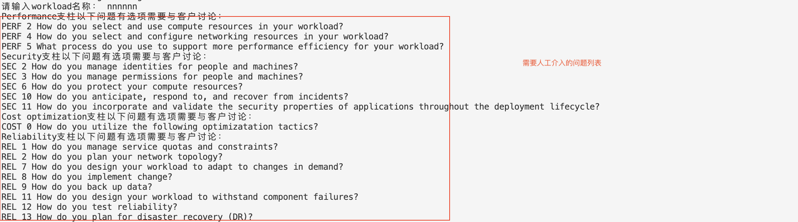
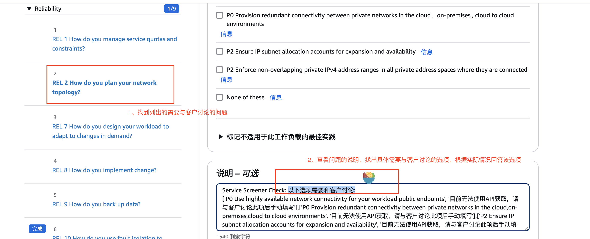

# AWS Well-Architected 报告自动化工具

此项目自动化了在 AWS 中创建和更新 Well-Architected Tool (WAT) 工作负载的过程，并基于 Service Screener 工具的发现。提供了一种自动化的方式回答WA中的相关问题，并提供相关解释和建议。目前可自动回答WA的GCR WAR key workload custom lens中约60%的选项。对于无法自动回答的部分请根据实际情况填写。具体无法回答的问题请查看附录-**需要与客户讨论的问题**

## 使用说明
SA使用时关注本节内容即可，其他章节仅作了解项目实现使用，无需关注。

### 安装

1. 确保您已安装 Python 3.6 或更高版本。
2. 克隆此存储库或通过网页下载zip代码：
   ```
   git clone git@ssh.gitlab.aws.dev:higuohui/GenerateGCRWAReport.git
   cd GenerateGCRWAReport
   ```
3. 安装所需的依赖项：
   ```
   pip install -r requirements.txt
   ```

### 开始使用
1. 在**客户账户**运行[Service screener工具](https://github.com/aws-samples/service-screener-v2/blob/main/README.md)，并同客户获取到报告output.zip,进行解压缩。
2. 在**Isengard账户**运行本仓库中的以下脚本，需要具备账户的WellArchitectedConsoleFullAccess权限。给定Service screener的报告output.zip解压缩后的目录名称，比如：
   ```
   python3 auto_compele_wa_report.py output.zip
   ```
4. 在提示时，输入您希望创建或更新 Well-Architected 工作负载的 AWS 区域 以及自定义的workload名称。
5. 运行完成后，脚本会列出目前需要客户参与讨论的问题，需要到Well-Architected Tool的问题，回答需要人工审查的选项，然后生成报告。


6. 与客户讨论WA的报告结果,并推荐可能的[solutions](https://amazon.awsapps.com/workdocs-amazon/index.html#/folder/c87b2437bc363b49b3dcfed587c16e59bb6f2d30049066fc0b0773cc222b8653)。


更多细节可参考[视频版完整流程](https://amazon.awsapps.com/workdocs-amazon/index.html#/document/a452deecd47e22a3aac673a70dcb7fefce463b2b0b28880761dd6f0080eae245)


### 故障排除

- 如果遇到权限错误，请确保您的 AWS 凭证具有访问 Well-Architected Tool 和创建/更新工作负载的必要权限。
- 如遇到其他错误，可联系higuohui@

## 存储库结构

- `auto_compele_wa_report.py`：用于自动生成 Well-Architected 报告的主要脚本。
- `requirements.txt`：列出了项目所需的 Python 依赖项。
- `res/`：包含额外资源和辅助脚本的目录。
  - `GCR WAR key workload custom lens.json`：Well-Architected Tool 的自定义透镜定义，其来源为[gcr-war-key-workload-custom-lens](https://gitlab.aws.dev/aws-gcr-sa/gcr-war-key-workload-custom-lens/-/blob/main/GCR%20WAR%20key%20workload%20custom%20lens.json?ref_type=heads) 。
  - `GCRWAjsontoexecl.py`：将 GCR KEY Workload JSON 数据转换为 Excel 格式的工具，以便人工阅读。
  - `ServicescreenerToGCRKeyWorkloadMapping.py`：Service Screener 发现到 Well-Architected 问题的映射脚本。
  - `SS_Finding_fix.json`：包含 Service Screener 发现和修复建议的 JSON 文件。
  - 一般情况下，您无需修改以上文件，此处只做了解使用。


## 数据流

1. 脚本首先从 Excel 文件加载 Service Screener 发现和 Well-Architected 问题之间的映射。
2. 然后，它使用提供的区域连接到 AWS Well-Architected Tool。
3. 根据 `GCR WAR key workload custom lens.json` 文件在 Well-Architected Tool 中导入或更新自定义透镜。
4. 脚本在 Well-Architected Tool 中创建新的工作负载或更新现有工作负载。
5. 处理 Service Screener 发现并映射到 Well-Architected 问题。
6. 使用基于映射发现的答案更新工作负载。
7. 最后，为工作负载生成报告。

```
[用户输入] -> [加载映射] -> [AWS Well-Architected Tool] -> [创建/更新工作负载]
                      |                        ^
                      v                        |
            [处理 SS 发现] --------> [更新答案]
                      |
                      v
               [生成报告]
```

注：脚本使用多处理来同时处理不同支柱的答案生成，提高大型工作负载的性能。

## 基础设施

该项目在 `res/GCR WAR key workload custom lens.json` 文件中定义了一个自定义 Well-Architected 透镜。该透镜侧重于安全支柱，包括以下关键资源：

- 包含安全支柱问题和选择的自定义透镜定义
- 用于评估工作负载安全态势的风险规则

该自定义透镜涵盖了重要的安全方面，例如：

- 使用 AWS 账户分离工作负载
- 保护根用户账户
- 实施强大的登录机制（MFA、密码策略）
- 使用临时凭证
- 安全存储和使用密钥
- 依赖于集中式身份提供商

自动化脚本使用这些基础设施定义在 AWS 中创建和更新 Well-Architected 工作负载。


# 附录
## 需要与客户讨论的问题
Performance支柱以下问题有选项需要与客户讨论：
<br>PERF 2 How do you select and use compute resources in your workload?
<br>PERF 4 How do you select and configure networking resources in your workload?
<br>PERF 5 What process do you use to support more performance efficiency for your workload?

Security支柱以下问题有选项需要与客户讨论：
<br>SEC 2 How do you manage identities for people and machines?
<br>SEC 3 How do you manage permissions for people and machines?
<br>SEC 6 How do you protect your compute resources?
<br>SEC 10 How do you anticipate, respond to, and recover from incidents?
<br>SEC 11 How do you incorporate and validate the security properties of applications throughout the deployment lifecycle?

Cost optimization支柱以下问题有选项需要与客户讨论：
<br>COST 0 How do you utilize the following optimizatation tactics?

Reliability支柱以下问题有选项需要与客户讨论：
<br>REL 1 How do you manage service quotas and constraints?
<br>REL 2 How do you plan your network topology?
<br>REL 7 How do you design your workload to adapt to changes in demand?
<br>REL 8 How do you implement change?
<br>REL 9 How do you back up data?
<br>REL 11 How do you design your workload to withstand component failures?
<br>REL 12 How do you test reliability?
<br>REL 13 How do you plan for disaster recovery (DR)?