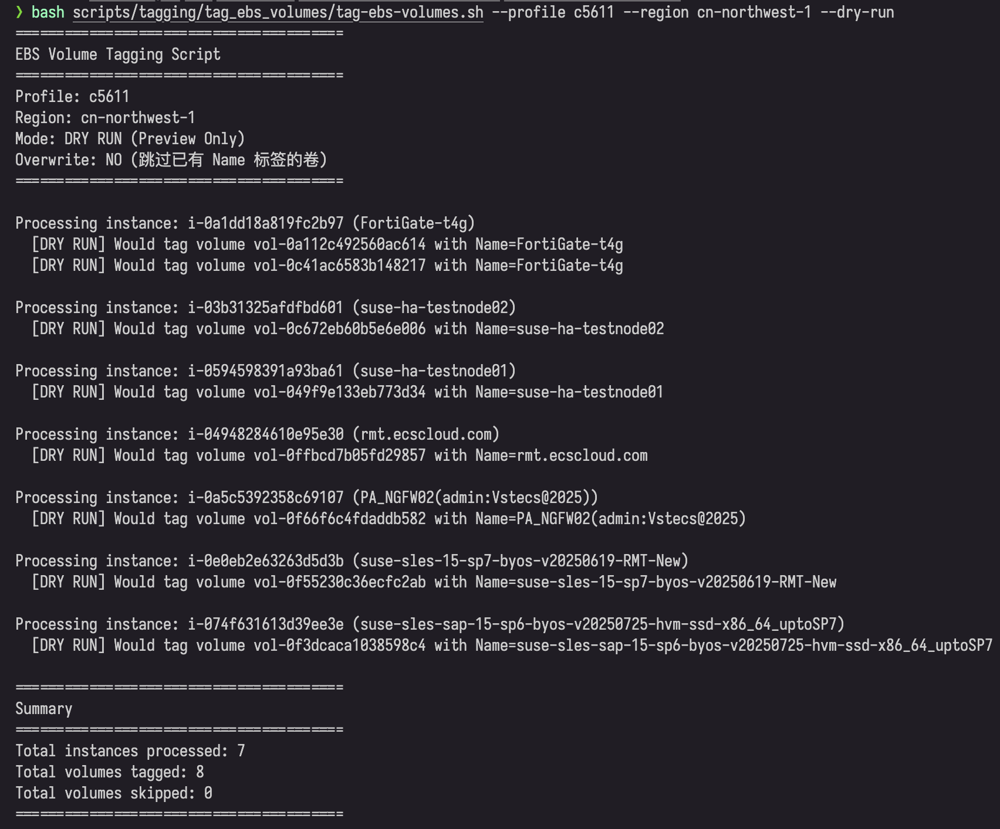

# EBS 卷自动标签脚本

**作者**: RJ.Wang  
**邮箱**: wangrenjun@gmail.com

将 EC2 实例的 Name 标签批量复制到其挂载的 EBS 卷。

## 使用方法

```bash
# 预览模式（推荐先执行）
./tag-ebs-volumes.sh --profile <profile> --region <region> --dry-run

# 实际执行
./tag-ebs-volumes.sh --profile <profile> --region <region>

# 覆盖已有标签
./tag-ebs-volumes.sh --profile <profile> --region <region> --overwrite
```

## 参数说明

| 参数 | 必需 | 说明 |
|------|------|------|
| `--profile` | ✅ | AWS CLI profile（c5611/g0603） |
| `--region` | ✅ | AWS 区域 |
| `--dry-run` | ❌ | 预览模式 |
| `--overwrite` | ❌ | 覆盖已有标签 |

## 使用示例

### 基本用法

```bash
# 中国区预览
./tag-ebs-volumes.sh --profile c5611 --region cn-northwest-1 --dry-run

# 中国区执行
./tag-ebs-volumes.sh --profile c5611 --region cn-northwest-1

# Global 区执行
./tag-ebs-volumes.sh --profile g0603 --region us-east-1
```

### 执行效果示例

以下是在中国区（宁夏）执行 dry-run 模式的实际输出：



**执行命令**：
```bash
bash scripts/tagging/tag_ebs_volumes/tag-ebs-volumes.sh --profile c5611 --region cn-northwest-1 --dry-run
```

**执行结果**：
- 处理的实例数：7 个
- 将要标记的卷数：8 个
- 跳过的卷数：0 个

脚本会显示每个实例及其关联的 EBS 卷，并在 dry-run 模式下预览将要执行的标签操作，不会实际修改任何资源。

## 所需权限

```json
{
  "Effect": "Allow",
  "Action": [
    "ec2:DescribeInstances",
    "ec2:DescribeVolumes",
    "ec2:CreateTags"
  ],
  "Resource": "*"
}
```

## 注意事项

- 首次使用务必先执行 dry-run 模式
- 默认跳过已有 Name 标签的卷
- 只处理当前挂载的 EBS 卷
- 跳过没有 Name 标签的实例
